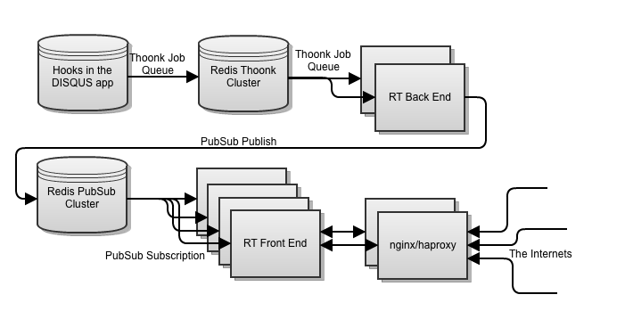

!SLIDE
# Making DISQUS realtime #
i'm adam, or
# @northisup #

!SLIDE bullets incremental
# How the old one worked #

* set a memcache key per thread
* nginx serves that key
* poll every 5 seconds

!SLIDE bullets incremental center
# Why this isn't working

* could only scale this to registered users
* 

!SLIDE bullets incremental
# Realertime! #

* built using python (we are good at python)
  * gevent
  * gunicorn

* and databases
  * redis
  * thoonk

!SLIDE center

!SLIDE bullets
* Back End throughput ~2000 messages/second
* Front End concurrency ~60,000 users per machine
